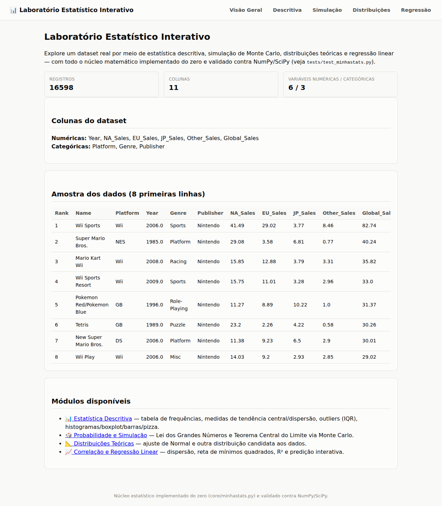
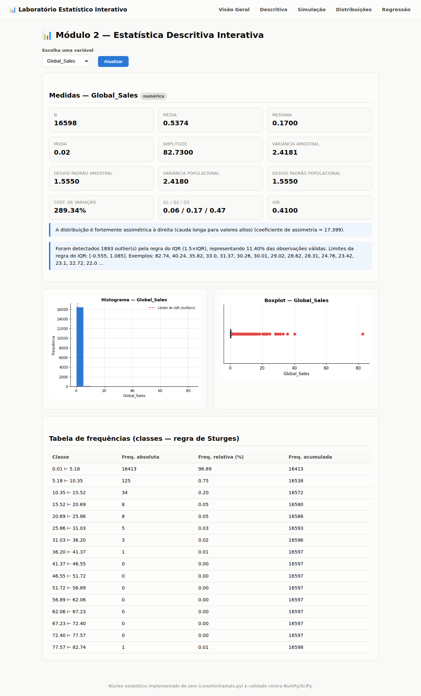
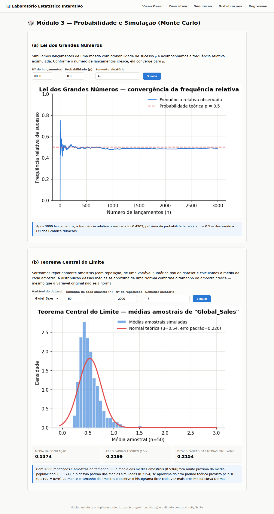
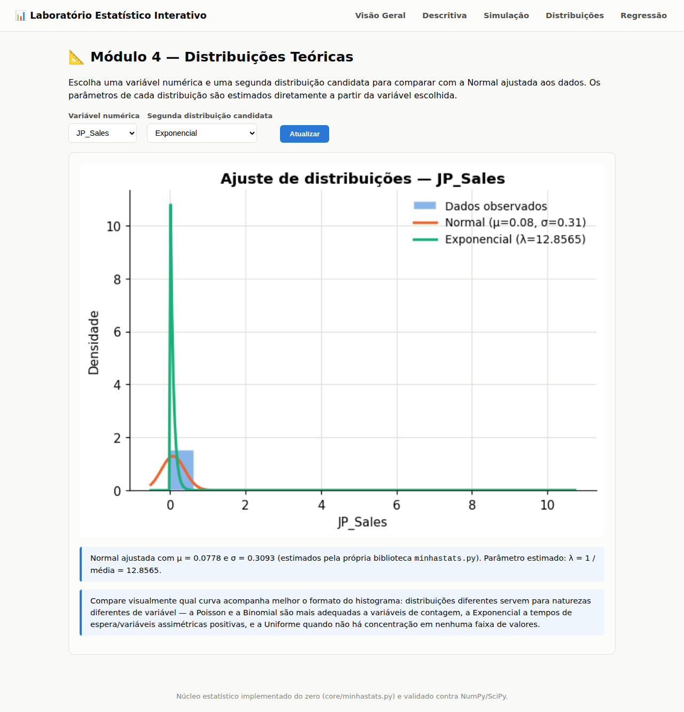
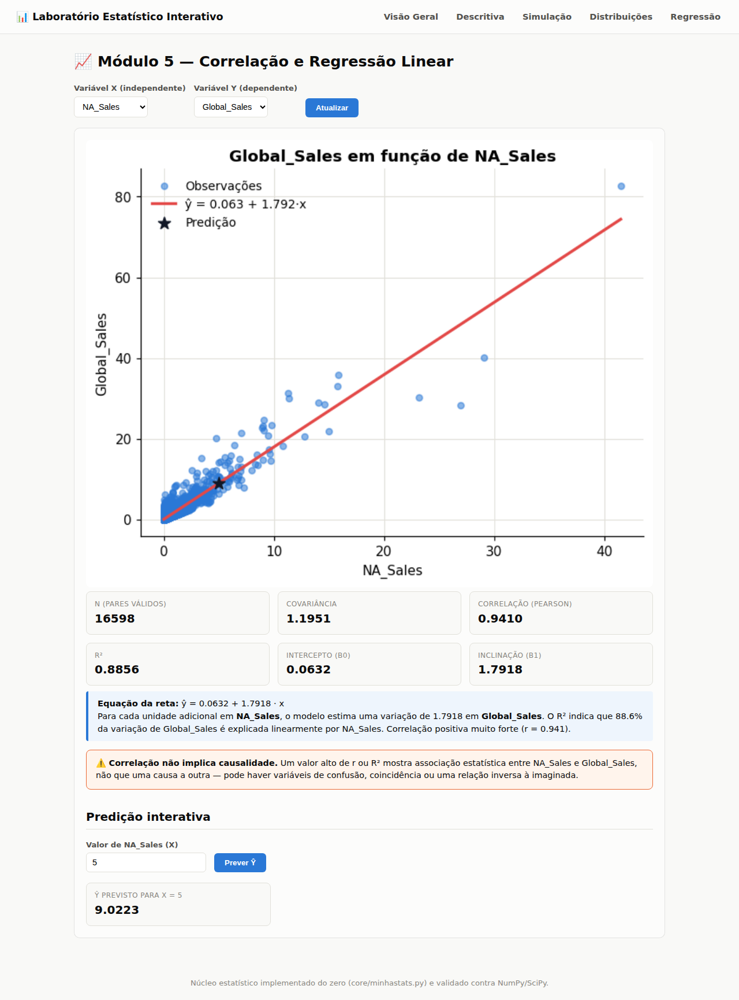

# 📊 Laboratório Estatístico Interativo

Aplicação web (Flask) que carrega um dataset real e permite explorá-lo por meio de
estatística descritiva, distribuições de probabilidade, simulação de Monte Carlo e
regressão linear — com **todo o núcleo matemático implementado do zero** (sem usar
funções prontas de estatística de NumPy/SciPy) e validado automaticamente contra
essas bibliotecas.

## 👤 Identificação

| Nome completo | Matrícula |
|---|---|
| Andrey Alves Monteiro | 261027294 |

Trabalho desenvolvido individualmente.

## 📦 Dataset

- **Nome:** Video Game Sales
- **Fonte original:** https://www.kaggle.com/datasets/gregorut/videogamesales
- **Registros:** 16.598 jogos (1980–2020)
- **Variáveis numéricas (6):** Year, NA_Sales, EU_Sales, JP_Sales, Other_Sales, Global_Sales
- **Variáveis categóricas (3):** Platform, Genre, Publisher

Mais detalhes sobre a escolha, justificativa e tratamento do dataset estão em
[`RELATORIO.md`](RELATORIO.md) e [`data/FONTE.md`](data/FONTE.md).

## 🧠 Estrutura do projeto

```
lab-estatistico/
├── core/
│   ├── minhastats.py     # núcleo estatístico implementado do zero
│   ├── data_loader.py    # carregamento e preparação do dataset (Pandas)
│   ├── simulacao.py      # Monte Carlo: Lei dos Grandes Números e TCL
│   └── graficos.py       # geração de gráficos (Matplotlib -> PNG base64)
├── app/
│   ├── server.py         # rotas Flask (um módulo por página)
│   ├── templates/        # HTML (Jinja2)
│   └── static/style.css
├── tests/
│   └── test_minhastats.py  # valida minhastats.py contra NumPy/SciPy/statistics
├── data/
│   ├── dataset.csv
│   └── FONTE.md           # link e descrição da fonte do dataset
├── run.py                 # ponto de entrada da aplicação
├── requirements.txt
├── RELATORIO.md
└── README.md
```

O núcleo estatístico (`core/minhastats.py`) é totalmente independente da interface
web — pode ser importado e usado em qualquer outro script Python.

## ⚙️ Instalação e execução (do zero)

Pré-requisitos: Python 3.10+ instalado.

```bash
# 1. Clonar o repositório
git clone https://github.com/alvesxzz/lab-estatistico.git
cd lab-estatistico

# 2. Criar e ativar um ambiente virtual (recomendado)
python3 -m venv .venv
source .venv/bin/activate        # Windows: .venv\Scripts\activate

# 3. Instalar as dependências
pip install -r requirements.txt

# 4. Rodar a aplicação
python run.py
```

Depois de rodar `python run.py`, abra **http://localhost:5000** no navegador.

## ✅ Rodando os testes automatizados

```bash
pytest tests/test_minhastats.py -v
```

Cada função de `minhastats.py` é comparada com a implementação equivalente de
NumPy/SciPy/statistics (ver tolerância numérica documentada no próprio arquivo de
testes). Caso o `pytest` não esteja disponível, o arquivo também roda como script
puro: `python3 tests/test_minhastats.py`.

## 🧩 Módulos da aplicação

| Módulo | Rota | Descrição |
|---|---|---|
| Visão geral | `/` | Resumo do dataset carregado |
| Estatística Descritiva | `/descritiva` | Tabela de frequências, medidas de tendência central/dispersão, histograma, boxplot, barras/pizza, outliers (IQR), interpretação automática |
| Probabilidade e Simulação | `/simulacao` | Lei dos Grandes Números e Teorema Central do Limite via Monte Carlo, com parâmetros controláveis |
| Distribuições Teóricas | `/distribuicoes` | Sobreposição de Normal + outra distribuição (Binomial/Poisson/Uniforme/Exponencial) ao histograma |
| Correlação e Regressão | `/regressao` | Dispersão, reta de mínimos quadrados, equação, R² e predição interativa de Ŷ |

## 📸 Capturas de tela

| Visão geral | Estatística Descritiva |
|---|---|
|  |  |

| Simulação (Monte Carlo) | Distribuições Teóricas |
|---|---|
|  |  |

| Correlação e Regressão |
|---|
|  |

Mais capturas (incluindo a versão categórica do Módulo 2) estão em `docs/screenshots/`.

## 🔬 Regra de ouro seguida no projeto

Pandas e NumPy são usados **apenas** para carregar/manipular o dataset (leitura de
CSV, filtragem de colunas). Toda medida estatística exibida na aplicação (médias,
variância, quartis, correlação, regressão etc.) vem das funções próprias em
`core/minhastats.py`.
