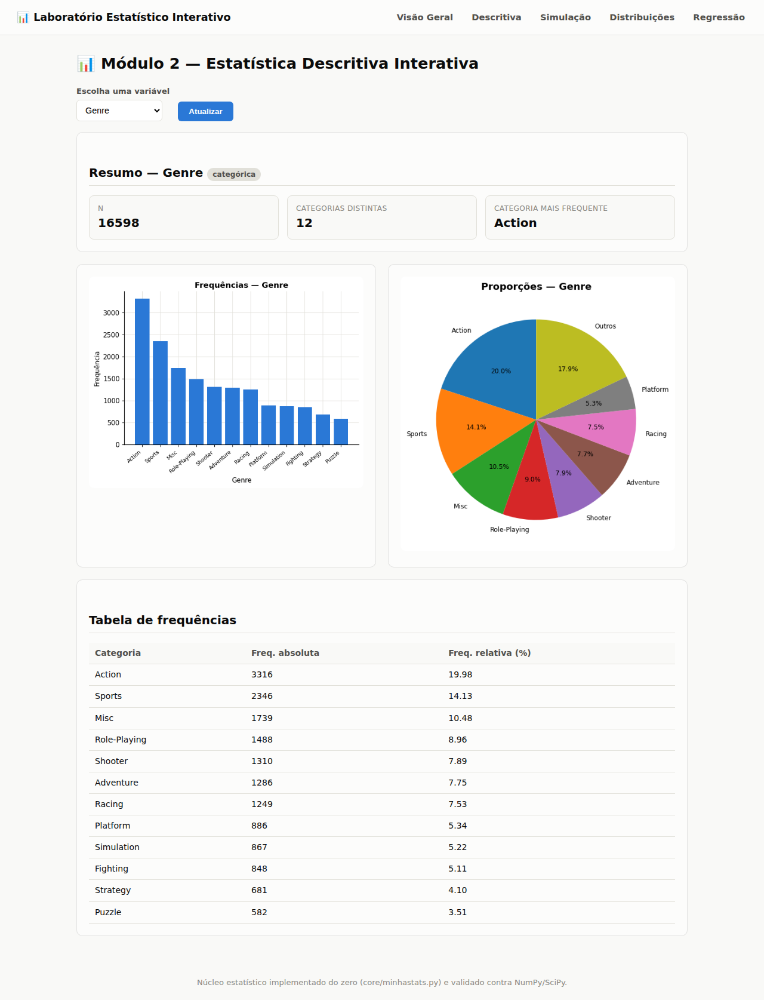

# Relatório — Laboratório Estatístico Interativo

**Autor:** Andrey Alves Monteiro — matrícula 261027294

## 1. Dataset escolhido e justificativa

**Dataset:** [Video Game Sales](https://www.kaggle.com/datasets/gregorut/videogamesales)
(Kaggle, autor: Gregory Smith, dados compilados a partir do site VGChartz).

**Justificativa:** o dataset traz 16.598 jogos lançados entre 1980 e 2020, muito acima do
mínimo de 1.000 registros exigido. Ele possui 6 variáveis numéricas relevantes (`Year` e as
vendas em milhões de unidades por região — `NA_Sales`, `EU_Sales`, `JP_Sales`, `Other_Sales`
— além de `Global_Sales`) e 3 variáveis categóricas (`Platform`, `Genre`, `Publisher`),
superando os mínimos de 4 e 2 respectivamente exigidos pelo enunciado. Além disso, é um tema
(jogos eletrônicos) que se presta bem aos módulos pedidos: a forte assimetria das vendas
(poucos "blockbusters" dominando o mercado) é um caso de uso natural para a regra do IQR, para
comparação com distribuições teóricas (Normal vs. Exponencial) e para a Lei dos Grandes
Números/TCL sobre uma variável real. As colunas `Rank` (índice de 1 a 16.598) e `Name`
(identificador quase único por linha) foram excluídas das análises por serem, na prática,
identificadores e não variáveis estatísticas — ver `data/FONTE.md` para mais detalhes.

## 2. Núcleo estatístico — fórmulas utilizadas

Todas as funções abaixo estão implementadas em `core/minhastats.py`, sem uso de
funções prontas de estatística (apenas operações aritméticas básicas).

### 2.1 Tendência central

**Média aritmética**

$$\bar{x} = \frac{1}{n}\sum_{i=1}^{n} x_i$$

**Mediana** — valor central da série ordenada:

$$
\text{mediana} =
\begin{cases}
x_{\left(\frac{n+1}{2}\right)} & \text{se } n \text{ é ímpar} \\[4pt]
\dfrac{x_{(n/2)} + x_{(n/2+1)}}{2} & \text{se } n \text{ é par}
\end{cases}
$$

**Moda** — valor(es) de maior frequência absoluta.

### 2.2 Dispersão

**Amplitude:** $A = x_{\max} - x_{\min}$

**Variância amostral e populacional:**

$$s^2 = \frac{\sum_{i=1}^n (x_i - \bar{x})^2}{n-1} \qquad\qquad \sigma^2 = \frac{\sum_{i=1}^n (x_i - \bar{x})^2}{n}$$

**Desvio padrão:** $s = \sqrt{s^2}$ (amostral) e $\sigma = \sqrt{\sigma^2}$ (populacional)

**Percentil p (interpolação linear, mesmo método do `numpy.percentile`, method="linear"):**

$$h = \frac{p}{100}(n-1), \qquad \text{percentil} = x_{(\lfloor h \rfloor)} + \big(h - \lfloor h \rfloor\big)\left(x_{(\lceil h \rceil)} - x_{(\lfloor h \rfloor)}\right)$$

Quartis: $Q_1 = P_{25}$, $Q_2 = P_{50}$, $Q_3 = P_{75}$. IQR $= Q_3 - Q_1$.

**Coeficiente de variação:** $CV = \dfrac{s}{\bar{x}} \times 100\%$

**Assimetria (skewness, viés amostral — mesma convenção do `scipy.stats.skew(bias=True)`):**

$$g_1 = \frac{1}{n}\sum_{i=1}^n \left(\frac{x_i - \bar{x}}{\sigma}\right)^3$$

### 2.3 Medidas bivariadas

**Covariância amostral:**

$$\text{cov}(x,y) = \frac{\sum_{i=1}^n (x_i-\bar{x})(y_i-\bar{y})}{n-1}$$

**Correlação de Pearson:**

$$r = \frac{\text{cov}(x,y)}{s_x \, s_y}$$

**Regressão linear simples (mínimos quadrados):**

$$\hat{y} = b_0 + b_1 x, \qquad b_1 = \frac{\text{cov}(x,y)}{s_x^2}, \qquad b_0 = \bar{y} - b_1\bar{x}$$

**Coeficiente de determinação:**

$$R^2 = 1 - \frac{\sum_i (y_i - \hat{y}_i)^2}{\sum_i (y_i - \bar{y})^2}$$

### 2.4 Regra do IQR para outliers

$$\text{limite inferior} = Q_1 - 1.5 \times IQR \qquad \text{limite superior} = Q_3 + 1.5 \times IQR$$

Valores fora desse intervalo são classificados como outliers.

### 2.5 Distribuições teóricas

| Distribuição | Densidade / massa | Parâmetros estimados dos dados |
|---|---|---|
| Normal | $f(x)=\dfrac{1}{\sigma\sqrt{2\pi}}e^{-\frac{(x-\mu)^2}{2\sigma^2}}$ | $\mu=\bar{x}$, $\sigma=s$ |
| Uniforme | $f(x)=\dfrac{1}{b-a}$ para $a\le x\le b$ | $a=x_{\min}$, $b=x_{\max}$ |
| Exponencial | $f(x)=\lambda e^{-\lambda x}$, $x\ge0$ | $\lambda = 1/\bar{x}$ |
| Poisson | $P(X=k)=\dfrac{\lambda^k e^{-\lambda}}{k!}$ | $\lambda=\bar{x}$ |
| Binomial | $P(X=k)=\binom{n}{k}p^k(1-p)^{n-k}$ | $n=x_{\max}$, $p=\bar{x}/n$ |

## 3. Validação contra bibliotecas consolidadas

O arquivo `tests/test_minhastats.py` compara cada função própria com a
implementação equivalente de NumPy, SciPy e da biblioteca padrão `statistics`,
usando `math.isclose` com tolerância absoluta/relativa de 1e-6 a 1e-9 (dependendo
da operação). Resultado da última execução:

```
26/26 testes passaram
```

| Função própria | Referência usada na validação | Resultado |
|---|---|---|
| `media` | `numpy.mean` | ✅ |
| `mediana` | `numpy.median` | ✅ |
| `moda` | `statistics.multimode` | ✅ |
| `amplitude` | `max - min` | ✅ |
| `variancia` (amostral/populacional) | `numpy.var(ddof=1/0)` | ✅ |
| `desvio_padrao` (amostral/populacional) | `numpy.std(ddof=1/0)` | ✅ |
| `percentil` / `quartis` / `iqr` | `numpy.percentile` | ✅ |
| `coeficiente_variacao` | cálculo manual com `numpy` | ✅ |
| `assimetria` | `scipy.stats.skew(bias=True)` | ✅ |
| `covariancia` | `numpy.cov(ddof=1)` | ✅ |
| `correlacao_pearson` | `scipy.stats.pearsonr` | ✅ |
| `regressao_linear_simples` (b0, b1, R²) | `scipy.stats.linregress` | ✅ |
| `detectar_outliers_iqr` | regra do IQR calculada manualmente com `numpy.percentile` | ✅ |
| `normal_pdf` | `scipy.stats.norm.pdf` | ✅ |
| `binomial_pmf` | `scipy.stats.binom.pmf` | ✅ |
| `poisson_pmf` | `scipy.stats.poisson.pmf` | ✅ |
| `uniforme_pdf` | `scipy.stats.uniform.pdf` | ✅ |
| `exponencial_pdf` | `scipy.stats.expon.pdf` | ✅ |

## 4. Prints e explicação de cada módulo

Capturas de tela completas estão em `docs/screenshots/`.

### Módulo 2 — Estatística Descritiva


Para `Global_Sales`: média = 0.5374, mediana = 0.17, desvio padrão amostral = 1.5550,
CV = 289.34%, Q1/Q2/Q3 = 0.06/0.17/0.47, IQR = 0.41. A regra do IQR classifica 1.893
observações (11.40%) como outliers — coerente com o coeficiente de assimetria de 17.4,
que indica uma distribuição extremamente assimétrica à direita. O histograma reflete bem
esse comportamento: praticamente toda a massa de dados fica concentrada perto de zero, com
uma cauda longa puxada por poucos "blockbusters" (Wii Sports, Super Mario Bros., Mario Kart
Wii...). O boxplot torna esse formato ainda mais evidente.



Para `Genre`: 12 categorias distintas, "Action" é a mais frequente (19.98% dos títulos),
seguida de "Sports" (14.13%).

### Módulo 3 — Probabilidade e Simulação


**(a) Lei dos Grandes Números:** simulando lançamentos de moeda (p=0.5), a frequência
relativa observada oscila bastante nas primeiras dezenas de lançamentos e se estabiliza
perto de 0.5 conforme n cresce — demonstração direta da LGN.

**(b) Teorema Central do Limite:** sorteando amostras de tamanho 50 da variável
`Global_Sales` (que, como visto no Módulo 2, é fortemente assimétrica — está longe de ser
Normal), a distribuição das 2.000 médias amostrais simuladas já se aproxima visivelmente de
uma curva Normal, com desvio padrão das médias simuladas muito próximo do erro padrão
teórico (σ/√n). Isso ilustra o TCL: mesmo a partir de uma população extremamente assimétrica,
a distribuição das médias amostrais tende à normalidade conforme o tamanho da amostra cresce.

### Módulo 4 — Distribuições Teóricas


Para `JP_Sales` (fortemente concentrada perto de zero, com poucos valores altos), a curva
Exponencial (λ = 1/x̄ ≈ 12.86) acompanha visualmente muito melhor o formato dos dados do que
a Normal ajustada — que, por ser simétrica, não consegue capturar a concentração de valores
próximos de zero nem a cauda longa à direita. Esse é um exemplo direto de como a natureza da
variável (tempos/valores não-negativos, fortemente assimétricos) orienta a escolha da
distribuição candidata.

### Módulo 5 — Correlação e Regressão


Para `NA_Sales` (X) vs. `Global_Sales` (Y): r = 0.9410, R² = 0.8856, reta ajustada
ŷ = 0.0632 + 1.7918·x. O mercado norte-americano por si só explica cerca de 88.6% da
variação nas vendas globais — a correlação mais forte entre todas as vendas regionais
testadas (ver Descoberta 2 abaixo).

## 5. Descobertas (Módulo 6)

1. **Mercado de "blockbusters":** as vendas globais (`Global_Sales`) são extremamente
   assimétricas à direita (coeficiente de assimetria = 17.4). A média (0.537 milhões de
   cópias) é mais de 3× a mediana (0.17 milhões), e a regra do IQR classifica 11.4% dos
   16.598 jogos como "outliers" — na prática, isso significa que uma minoria de títulos
   (Wii Sports, Super Mario Bros., Mario Kart Wii, Wii Sports Resort, Pokémon Red/Blue...)
   concentra uma fatia desproporcional das vendas totais do mercado, enquanto a maioria dos
   jogos vende relativamente pouco.

2. **América do Norte é o melhor "termômetro" do sucesso global — o Japão marcha à parte:**
   comparando a correlação de cada mercado regional com `Global_Sales`, `NA_Sales` tem a
   correlação mais forte (r = 0.941, R² = 0.886), seguida de `EU_Sales` (r = 0.903,
   R² = 0.815) e `Other_Sales` (r = 0.748, R² = 0.560). `JP_Sales` tem, disparadamente, a
   correlação mais fraca (r = 0.612, R² = 0.374) — ou seja, o desempenho de um jogo no Japão
   é o que menos se alinha com seu desempenho mundial, um indício de que o mercado japonês
   tem preferências de consumo mais particulares (forte presença de RPGs e franquias
   locais) do que os demais mercados.

3. **Quantidade não é qualidade — de vendas:** o gênero "Action" é o mais produzido
   (3.316 títulos, 19.98% do catálogo), mas tem vendas médias por título de apenas 0.528
   milhões de cópias. Já o gênero "Platform", com menos de um terço dos lançamentos (886
   títulos, 5.34%), tem a maior média de vendas por título entre os gêneros populares
   (0.938 milhões) — cerca de 1.78× a média de "Action". Isso sugere que os gêneros
   mais saturados em quantidade de lançamentos não são necessariamente os que mais vendem
   por título, possivelmente refletindo tanto a qualidade/força das franquias de plataforma
   (Mario, Sonic) quanto a maior concorrência dentro do gênero Action.

*(Números recalculados diretamente pela aplicação a partir de `core/minhastats.py` — ver
Módulos 2 e 5 nas capturas de tela acima.)*
